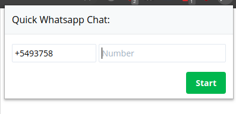

# Quick Whatsapp Chat
> Chrome extencion to start a Whatsapp chat without adding the number to contacts...





## Development setup

```sh
npm i

npm run dev:chrome
or
npm run dev:firefox
or
npm run dev:opera
```
## Build
```sh
npm i

npm run build:chrome
or
npm run build:firefox
or
npm run build:opera

```


## Release History
* 2.0.2
    * add flags input

* 2.0.1
    * Fix required data
    * Added Readme.

* 2.0.0
    * Stable

## Meta

Emiliano Fernandez – [@emilianohf](https://twitter.com/emilianohf)

Distributed under the MIT license. See ``LICENSE`` for more information.

[https://github.com/emilianox/Quick_Whatsapp_Chat](https://github.com/emilianox/Quick_Whatsapp_Chat)
